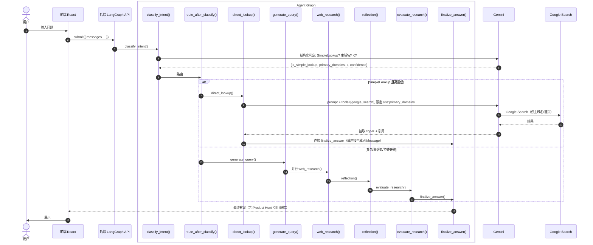

```mermaid
sequenceDiagram
autonumber
actor User as 用户
participant FE as 前端 React
participant BE as 后端 LangGraph API
box Agent Graph
  participant INT as classify_intent()
  participant ROUTE as route_after_classify()
  participant DLOOK as direct_lookup()
  participant GEN as generate_query()
  participant WR as web_research()
  participant REF as reflection()
  participant EVAL as evaluate_research()
  participant FIN as finalize_answer()
end
participant GEM as Gemini
participant GSR as Google Search

User->>FE: 输入问题
FE->>BE: submit({ messages ... })

BE->>INT: classify_intent()
INT->>GEM: 结构化判定: SimpleLookup? 主域名? K?
GEM-->>INT: {is_simple_lookup, primary_domains, k, confidence}

INT->>ROUTE: 路由

alt SimpleLookup 且高置信
  ROUTE->>DLOOK: direct_lookup()
  DLOOK->>GEM: prompt + tools=[google_search], 限定 site:primary_domains
  GEM->>GSR: Google Search（仅主域名/首页）
  GSR-->>GEM: 结果
  GEM-->>DLOOK: 抽取 Top-K + 引用
  DLOOK->>FIN: 直接 finalize_answer（或直接生成 AIMessage）
else 复杂/置信低/直查失败
  ROUTE->>GEN: generate_query()
  GEN->>WR: 并行 web_research()
  WR->>REF: reflection()
  REF->>EVAL: evaluate_research()
  EVAL->>FIN: finalize_answer()
end

FIN-->>FE: 最终答案（含 Product Hunt 引用/链接）
FE->>User: 展示
```