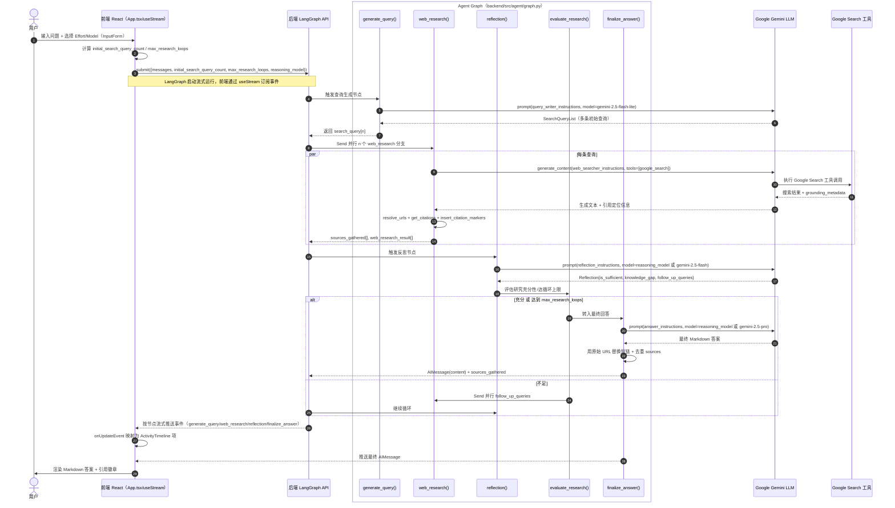

```mermaid
sequenceDiagram
autonumber
actor User as 用户
participant FE as 前端 React（App.tsx/useStream）
participant BE as 后端 LangGraph API
box Agent Graph（backend/src/agent/graph.py）
  participant GEN as generate_query()
  participant WR as web_research()
  participant REF as reflection()
  participant EVAL as evaluate_research()
  participant FIN as finalize_answer()
end
participant GEM as Google Gemini LLM
participant GSR as Google Search 工具

User->>FE: 输入问题 + 选择 Effort/Model（InputForm）
FE->>FE: 计算 initial_search_query_count / max_research_loops
FE->>BE: submit({messages, initial_search_query_count, max_research_loops, reasoning_model})

note over BE,FE: LangGraph 启动流式运行，前端通过 useStream 订阅事件

BE->>GEN: 触发查询生成节点
GEN->>GEM: prompt(query_writer_instructions, model=gemini-2.5-flash-lite)
GEM-->>GEN: SearchQueryList（多条初始查询）
GEN-->>BE: 返回 search_query[n]

BE->>WR: Send 并行 n 个 web_research 分支
par 每条查询
  WR->>GEM: generate_content(web_searcher_instructions, tools=[google_search])
  GEM->>GSR: 执行 Google Search 工具调用
  GSR-->>GEM: 搜索结果 + grounding_metadata
  GEM-->>WR: 生成文本 + 引用定位信息
  WR->>WR: resolve_urls + get_citations + insert_citation_markers
  WR-->>BE: sources_gathered[], web_research_result[]
end

BE->>REF: 触发反思节点
REF->>GEM: prompt(reflection_instructions, model=reasoning_model 或 gemini-2.5-flash)
GEM-->>REF: Reflection{is_sufficient, knowledge_gap, follow_up_queries}
REF->>EVAL: 评估研究充分性/达循环上限

alt 充分 或 达到 max_research_loops
  EVAL->>FIN: 转入最终回答
  FIN->>GEM: prompt(answer_instructions, model=reasoning_model 或 gemini-2.5-pro)
  GEM-->>FIN: 最终 Markdown 答案
  FIN->>FIN: 用原始 URL 替换短链 + 去重 sources
  FIN-->>BE: AIMessage(content) + sources_gathered
else 不足
  EVAL->>WR: Send 并行 follow_up_queries
  BE->>REF: 继续循环
end

BE-->>FE: 按节点流式推送事件（generate_query/web_research/reflection/finalize_answer）
FE->>FE: onUpdateEvent 映射为 ActivityTimeline 项
FIN-->>FE: 推送最终 AIMessage
FE->>User: 渲染 Markdown 答案 + 引用徽章
```