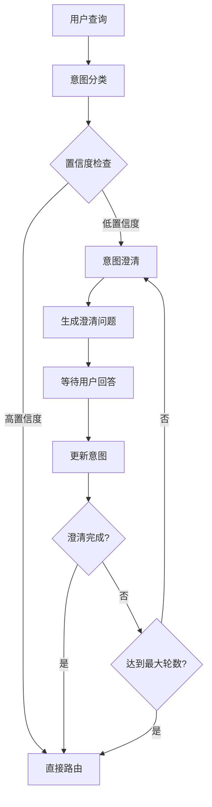

# 意图澄清功能使用说明

## 功能概述

意图澄清功能是对原有意图识别节点的重要增强，通过多轮对话澄清用户意图，解决了单次判断的局限性。当用户查询模糊或信息不足时，系统会主动询问澄清问题，直到获得足够信息或达到最大澄清轮数。

## 核心特性

### 1. 多轮对话支持
- 支持最多3轮澄清对话（可配置）
- 每轮都会基于用户回答更新意图理解
- 自动跟踪澄清进度和对话历史

### 2. 智能澄清问题生成
- 基于当前意图分析生成针对性问题
- 识别缺失的关键信息（公司名称、项目类型、时间范围等）
- 提供友好的用户交互体验

### 3. 自循环流程控制
- 当置信度低于阈值时自动触发澄清
- 支持用户主动跳过澄清直接进行研究
- 达到最大轮数后自动进入研究流程

## 工作流程



## 配置参数

### 状态字段
- `clarification_count`: 当前澄清轮数
- `max_clarification_rounds`: 最大澄清轮数（默认3）
- `intent_clarified`: 意图是否已澄清
- `conversation_history`: 对话历史记录

### 配置选项
- `intent_confidence_threshold`: 意图置信度阈值（默认0.7）
- `enable_intent_router`: 是否启用意图路由（需要开启）

## 使用示例

### 示例1：模糊供应商查询
```
用户: "我想找项目"

系统澄清问题:
1. 请问您是哪家公司或机构？这样我可以为您推荐更相关的项目机会。
2. 您主要关注哪个行业或领域的项目？比如建筑、IT、制造等。
3. 您希望了解最近多长时间内的项目信息？

用户回答: "我们是华信科技，主要做软件开发"

系统: 基于澄清信息进行针对性研究...
```

### 示例2：不完整公司查询
```
用户: "我们公司想参与建设项目"

系统澄清问题:
1. 请问贵公司的具体名称是什么？
2. 您们主要提供什么类型的建设服务？比如土建、装修、设备安装等。
3. 希望参与哪个地区的项目？

用户: "跳过"

系统: 直接基于现有信息进行研究...
```

## 技术实现

### 核心节点

#### `clarify_intent` 节点
- 分析当前意图和对话历史
- 生成结构化澄清结果
- 处理用户中断和回答更新

#### 路由函数
- `route_after_classify`: 分类后路由决策
- `route_after_clarify`: 澄清后路由决策

### 提示词模板
使用 `intent_clarification_instructions` 模板生成澄清问题：
- 分析用户查询和当前意图
- 识别缺失的关键信息
- 生成友好的澄清问题列表

### 状态管理
- 自动跟踪澄清轮数和历史
- 支持意图信息的增量更新
- 处理用户跳过和异常情况

## 测试验证

### 测试脚本
使用 `backend/examples/test_intent_clarification.py` 进行功能测试：

```bash
# 激活虚拟环境
backend\.venv\Scripts\activate

# 运行测试
cd backend
python examples/test_intent_clarification.py
```

### 测试用例
1. **模糊供应商查询**: 验证澄清问题生成
2. **不完整公司查询**: 测试信息补全流程
3. **明确查询**: 确认直接路由正确性
4. **多轮澄清循环**: 验证循环控制逻辑

## 最佳实践

### 1. 澄清问题设计
- 问题要具体明确，避免过于宽泛
- 提供选择选项或示例帮助用户理解
- 保持友好的对话语调

### 2. 轮数控制
- 建议最大澄清轮数设置为2-3轮
- 避免过度澄清影响用户体验
- 提供跳过选项给用户自主选择

### 3. 意图更新策略
- 基于用户回答增量更新意图信息
- 保持原有高置信度信息不变
- 合理提升澄清后的置信度

## 故障排除

### 常见问题

1. **澄清问题不够针对性**
   - 检查提示词模板是否包含足够上下文
   - 确认意图分析结果的准确性

2. **循环控制异常**
   - 验证路由函数的条件判断逻辑
   - 检查状态字段的更新是否正确

3. **用户回答处理失败**
   - 确认对话历史的格式和更新机制
   - 检查意图重新分类的触发条件

### 调试建议
- 启用详细日志查看澄清流程
- 使用测试脚本验证各个环节
- 检查配置参数是否正确设置

## 扩展方向

### 1. 智能化增强
- 基于历史对话学习用户偏好
- 动态调整澄清策略和问题类型
- 集成更多上下文信息源

### 2. 多模态支持
- 支持图片、文档等多媒体澄清
- 语音交互和实时澄清
- 结构化表单填写模式

### 3. 个性化定制
- 基于用户角色定制澄清流程
- 行业特定的澄清问题模板
- 可配置的澄清策略选择
