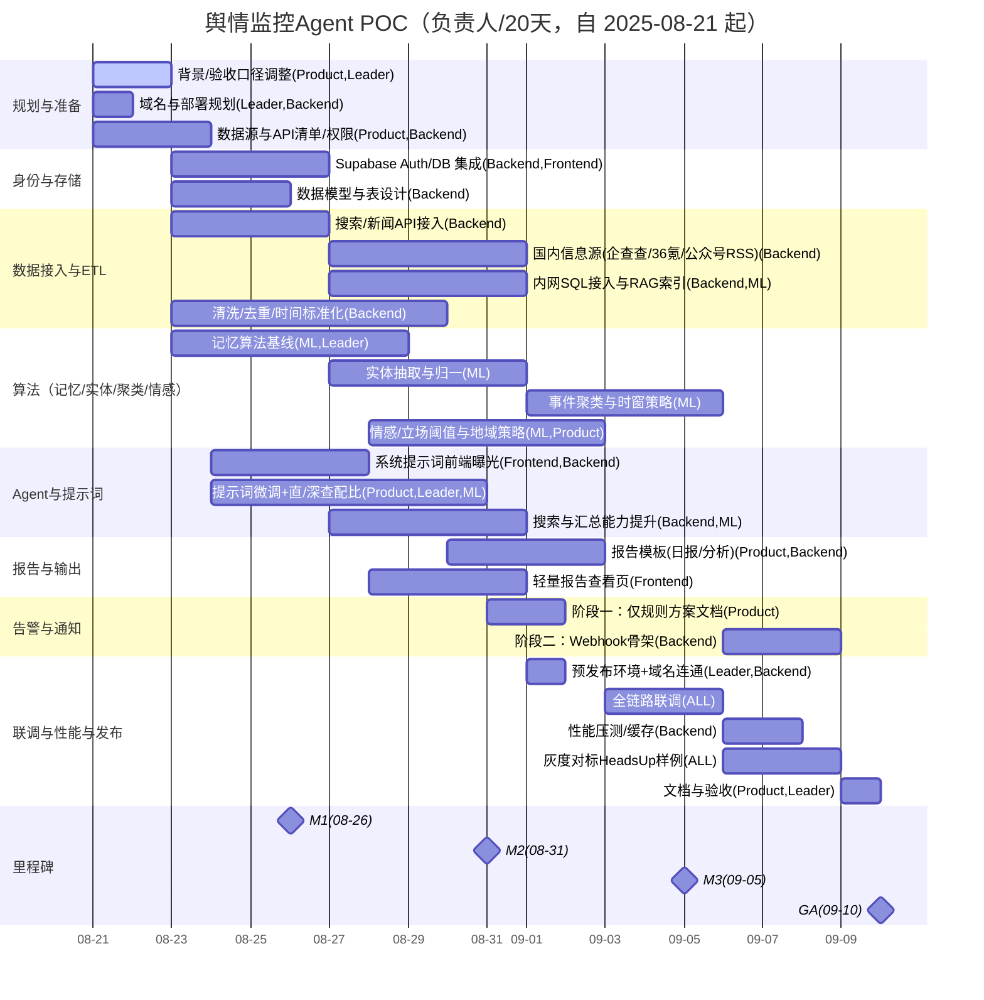

# 测试用例
直接对话：今天几号，天气如何
官网查询：Python最新稳定版本号是多少？
研究转直接查询：特朗普今天发言对乌克兰有何影响？
研究：
  low 研究下深圳犀照科技和Material Bank的业务相似性和商业潜力
  mid Research Macaron AI founder team, business and tech
  研究这个网站 https://decoris.ch/
  研读这篇论文 https://arxiv.org/html/2508.14971v1

# TODO
    web_research_result 全链路测试
    核心：
      1. 搜索、汇总能力提升
      2. 记忆算法研究
    BUG
      手动解决两次HITL问题
      LLM给出预估时间过长 （天）
      web_research 确认是否固定翻译（不要总是翻译）
      500 中断恢复
      handle_follow_up
    开发类
      thinking_startup_stage 之后 支持直接阅读网址或文件内容
      目标TODO
      查询词拆分
      Error友好
      日志缩减
      系统提示词暴露到前端给用户
      全部提示词增加：“以用户相同的语言回答用户的问题”
      发布上线 域名
      整合supbase登录和数据库
      数据接口 + 其他工具接口（秘塔） + 搜索接口
    研究优化类（优先级：低）
      意图识别可循环HITL确认
      Effort不要限定查询伦次，而是结果导向，如打分60 70 80
      直查/深度查 配比
      提示词微调(数据信源地域优化 如中文问题优先中文网站)
      搜索词使用的语言
      Agent自己决定节点，甚至运行时动态生成节点

## 下一步（今天）
- __[产品]__ 完成“关键词/实体清单 + 验收口径/示例告警”。  
- __[后端]__ 整理数据源与API权限清单，落地速率限制与缓存设计。  
- __[算法]__ 产出实体归一与聚类方案评估基线（样例+阈值初稿）。  
- __[前端]__ 出首屏仪表盘线框与数据契约草案。

## 与现有代码对接点
- __Agent路由/提示词__：在 [backend/src/agent/prompts.py](cci:7://file:///e:/WorkSpace/gemini-fullstack-langgraph-quickstart/backend/src/agent/prompts.py:0:0-0:0) 与 [backend/src/agent/graph.py](cci:7://file:///e:/WorkSpace/gemini-fullstack-langgraph-quickstart/backend/src/agent/graph.py:0:0-0:0) 增强“权威源/主页优先/证据溯源”；输出摘要与告警解释模板。
- __数据API__：新增抓取与聚类/情感服务接口，供前端仪表盘与告警流水线调用。
- __日志与监控__：沿用现有 `logger.info` 路径，补充告警/聚类/情感观测项。

# 项目背景
结合犀照科技（室内设计材料平台）内部网站的用户埋点数据（用户搜索、收藏、立项等行为）
和外部公开数据（搜索引擎、新闻、论坛、社交媒体等），
为设计机构和供应商两类用户提供企业竞争情报（企业信息、招投标项目信息）、推荐相似项目、智能分析报告等功能。

## 总体设计
    在传统的DeepResearch Agent基础上，增加记忆模块，增加RAG(内部数据)能力。
    输入：用户问题或官网URL
    输出：相关项目列表 + 智能分析报告

## 总体流程Pipeline
    1. 收集公开信息 通过API 爬虫等 + 收集内网（自己平台）数据 通过SQL
    2. 数据清洗 入库（DB + Vector）
    3. Agent Research
    4. Report and Dashboard

## 数据与策略
- 辐射数据源：新闻/搜索/RSS/社媒/社区，统一抓取、去重、聚类、情感与负面强度评估，形成“事件流 + 趋势/热词 + 告警”。
- 保留现有 Agent 框架与路由，强化“权威源/官网优先、主页起步、可验证证据”提示词策略（参考 [backend/src/agent/prompts.py](cci:7://file:///e:/WorkSpace/gemini-fullstack-langgraph-quickstart/backend/src/agent/prompts.py:0:0-0:0)、[backend/src/agent/graph.py](cci:7://file:///e:/WorkSpace/gemini-fullstack-langgraph-quickstart/backend/src/agent/graph.py:0:0-0:0)）。

# 开发工作量/排期（一期：POC）
以数据准备、调接口、提示词调试为主。
团队：Leader（Neo Pipeline预研 搭建 测试）、算法×1（外部API+OCR+召回）、前端×1、后端×1（内部数据）、产品×1（输出标准+Prompt微调）。

## 角色分工
- 角色映射
  - Leader：Neo
    Pipeline、项目资料库、风险/资源协调、验收口径。
  - 产品：Product Allen
    需求梳理、策略校准、数据口径/兜底规则。
  - 后端：Backend
    内部数据提取与存储、提示词优化（速率限制与缓存）
  - 前端：Frontend
    可视化
  - 算法：ML
    外部数据接入/聚类/情感与负面强度/召回-精排

- 核心方向
  - 搜索与汇总能力提升（权威源/证据/主页优先）：负责人 ML，协作 Backend
  - 记忆算法研究（含内部RAG对接）：负责人 Leader，协作 ML、Backend

- TODO/研究类
  - 直查/深度查 配比测验：负责人 Leader，协作 ML
  - 提示词微调：负责人 Leader，协作 Backend

- TODO/开发类
  - 系统提示词暴露到前端给用户：负责人 Frontend，协作 Backend
  - 发布上线/域名与预发布环境：负责人 Leader，协作 Backend
  - Supabase 登录和数据库：负责人 Backend，协作 Frontend
  - 数据接口 + 其他工具接口（秘塔） + 搜索接口：负责人 Backend，协作 ML（召回/排序策略）

- 数据与策略（外部/内部）
  - 外部源（新闻/搜索/RSS/社媒/社区；国内：企查查/36氪/公众号RSS[RSSHub] 等；国际：Google/Bing/SerpAPI/Reddit/HN）：负责人 Backend，协作 Product（合规与优先级）
  - 内网SQL数据接入与RAG建索引：负责人 Backend，协作 ML（索引/召回）
  - 清洗去重/标准化：负责人 Backend
  - 实体抽取与归一：负责人 ML
  - 事件聚类（MinHash/SimHash/HDBSCAN/时窗）：负责人 ML
  - 情感/立场/地域策略与阈值：负责人 ML，协作 Product（黑白名单/口径）
  - 报告模板（日报/分析）：负责人 Product，协作 Backend
  - 通知与告警（阶段一不做，阶段二骨架）：负责人 Backend，协作 Product

## 工作分解与可交付物（详情）
- 数据源与API（负责人：
  - 新闻/搜索：国内：企查查+爬虫+博查 国际：Google/Bing/serpapi。
  - 社媒/社区：36氪/公众号RSS/知乎/X(Twitter)/Reddit/Hacker News。
  - 可交付物：入向量库。
  - 待确认：切片策略
- 抓取与清洗（ETL）（负责人：
  - 去广告、语言检测、时间标准化、指纹去重（URL归一+SimHash）。
  - 可交付物：统一文档Schema、ETL作业与任务编排。
- 实体与聚类（负责人：
  - 一阶段：（初步简易POC）
    - 
  - 二阶段：
    - NER+实体归一（公司/产品/人物/品牌/股票），事件聚类（MinHash/SimHash/HDBSCAN/时窗）。
    - 可交付物：实体库与链接规则、事件聚类服务与评估报告。
- 情感/立场/地域文化（负责人：
  - 中英文支持或海外海内两个版本（待确认）；阈值校准与质检SOP；敏感词/黑白名单。
  - 可交付物：评分服务与阈值配置、负面榜单。
  - 待确认：海外海内版本
- Agent 调整与提示词（负责人：
  - 工具/路由适配舆情场景；证据溯源与“主页优先”指引；摘要/日报/告警解释模板。
  - 可交付物：新模板与回归用例；参考 HeadsUp 的示例输出。
- 告警与通知（负责人：
  - 一阶段：（初步简易POC）
    - 不做通知
  - 二阶段：
    - 频控、合并相似事件、黑白名单；Email/Slack/企微/飞书 Webhook。
    - 可交付物：告警规则引擎与通知流水线。
- 后端 API/数据模型（负责人：
  - 事件/文档/实体/指标Schema；向量库/倒排/缓存；分页/筛选/导出。
  - 可交付物：OpenAPI/接口文档与性能基线。
- 前端仪表盘（负责人：
  - 一阶段：（初步简易POC）
    - 不做仪表盘
  - 二阶段：
    - 趋势、热词、事件流、告警设置/订阅；来源与证据回链。
    - 可交付物：Dashboard可点击原型+集成联调版本。
- 联调与性能（负责人：
  - QPS/速率限制/缓存命中；HTTPCache；A/B对比与灰度。
  - 可交付物：压测报告与优化清单。
- 交付与文档（负责人：
  - README、运维手册、提示词指南、监控报警说明与SLA。

# 里程碑（更新，T0=2025-08-21，20天）
- M1（D+5，至 08-26）
  - Supabase Auth/DB 接入骨架
  - 搜索/新闻 API 接入样例与速率限制策略
  - 外部/内部数据源清单与权限完成
  - ETL 清洗/去重骨架跑通
  - 前端“系统提示词曝光”设置页雏形
- M2（D+10，至 08-31）
  - 内网 SQL 接入与 RAG 索引（初版）
  - 记忆算法基线可用，实体归一（初版）
  - 搜索+汇总能力提升，直查/深查配比试验阶段性结论
  - 报告生成模板（初版），API 对外稳定
- M3（D+15，至 09-05）
  - 事件聚类（可用）+ 情感/负面强度（阈值初版）
  - 报告查看页（轻量，代替重仪表盘）
  - Agent 提示词版本1（权威源/主页优先/证据溯源）
  - 预发布环境与域名连通、性能基线
- GA（D+20，至 09-10）
  - 全链路联调与灰度对标 HeadsUp 样例
  - Webhook 告警骨架（频控/黑白名单预置，默认关闭）
  - 文档与验收

# 甘特图

# 备注
- 前端本期目标是“系统提示词设置 + 报告查看”。
- 国内源优先使用合规API与RSSHub，必要时以“缓存+退避+限频”落地。

## 风险与对策
- __API限额/合规__：优先有配额的商业API；本地缓存+退避重试；对大陆不可用源准备代理/替代源。
- __中文语料/歧义__：专为中文优化的情感词典+基座模型；负面样本回归集迭代阈值。
- __降噪难度__：黑白名单、域名信誉、事件合并、窗口频控。
- __证据可追溯__：前端保留原文链接与快照；后端存储grounding元数据。

## 验收指标（示例）
- __告警准确度__：负面事件TopN的P@N≥0.8。
- __延迟__：新事件到达至入库≤2分钟，告警生成≤1分钟。
- __稳定性__：24h 连续运行无致命错误；速率限制命中后自动恢复。
- __抓取覆盖率__：目标源可用率≥95%，单源重试成功率≥98%。
